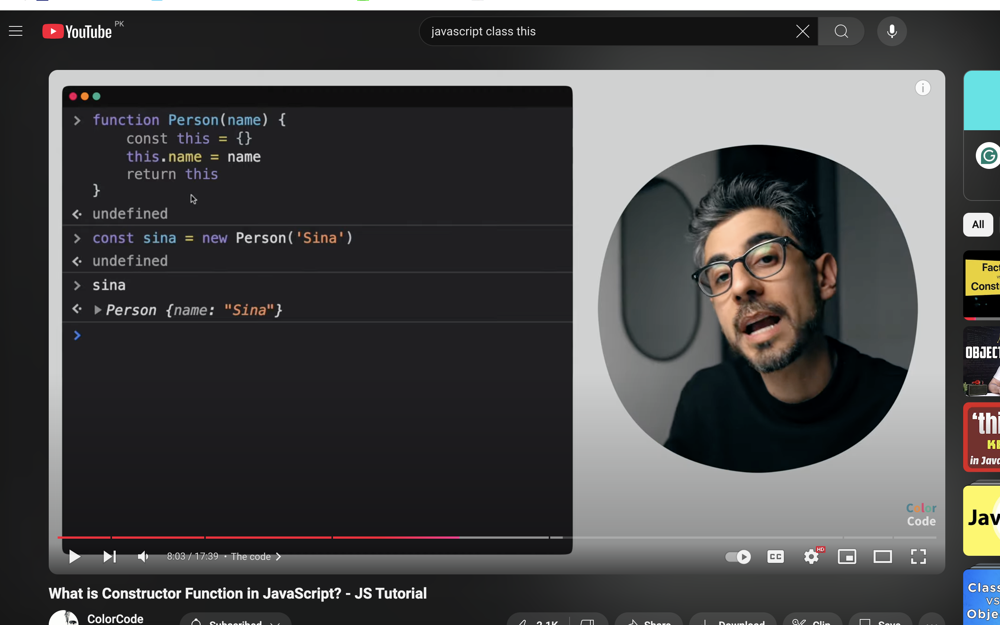

In a sense, the `new` keyword hijacks a function and forces its behavior into a different mode than a normal invocation. Here are the 4 special steps that JS performs when a function is invoked with `new`:

1. create a brand new empty object, out of thin air.
2. link the `[[Prototype]]` of that new empty object to the function's `.prototype` object (see Chapter 2).
3. invoke the function with the `this` context set to that new empty object.
4. if the function doesn't return its own object value explicitly (with a `return ..` statement), assume the function call should instead return the new object (from steps 1-3).
5. new before a function automatically creates a this object and returns that object from the function
